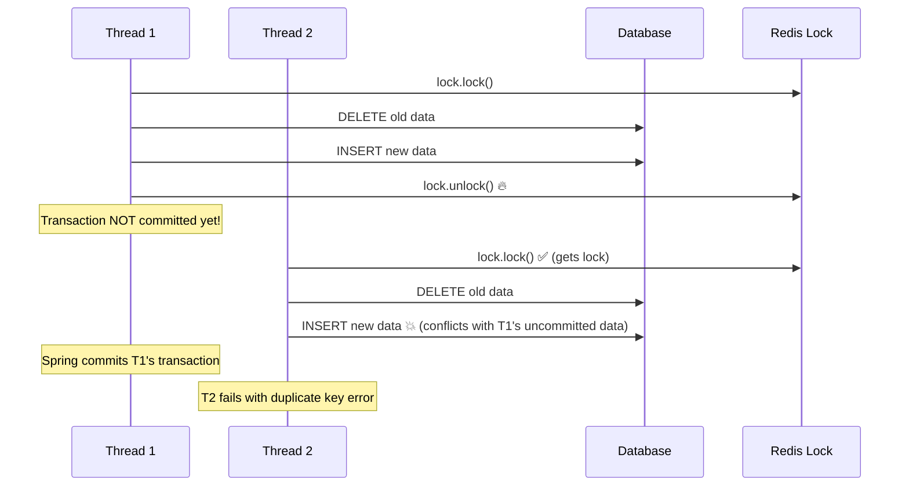

一个看似普通的数据刷新接口，背后却牵扯出 JDBC 插入性能瓶颈、事务提交时机与分布式锁配合失误、PostgreSQL 死锁等一系列"致命联动"。

<!-- more -->


**血泪教训**
本文记录了一次线上性能优化的完整过程，从 20 秒的插入耗时到 1-2 秒的极致优化，从频繁的并发冲突到零错误率的稳定运行。每一个坑都是用真金白银踩出来的！


## 🧩 业务背景

我们有一个 ETL 数据刷新功能，负责将**清洗完的结果数据写回数据库**。这个看似简单的功能，却在高并发场景下暴露出了一系列问题。

### 📋 接口设计

**入参结构：**
- `tableName`：目标 DWB 表名
- `List<Map<String, Object>> data`：清洗后数据，每条数据约 20 个字段

**核心逻辑：**
1. 按业务主键（如 `biz_id`）进行**分组**
2. 每个组**串行执行**：先删除旧数据 → 插入新数据（**在同一个事务中完成**）
3. 并发调用时，不同组之间通过分布式锁串行化（以 `biz_id` 为单位）

### 🎯 预期 vs 现实

理想很丰满，现实很骨感。下面的对比表清晰展示了我们遇到的三大核心问题：

| 维度 | 预期 | 现实 |
|------|------|------|
| **性能** | 2000 条数据秒级插入 | 20+ 秒才能完成 😱 |
| **并发安全** | 分布式锁保证数据一致性 | 频繁主键冲突 💥 |
| **稳定性** | 高并发下稳定运行 | 数据库死锁频发 ⚠️ |

## 💥 问题一：插入性能瓶颈


**性能灾难现场**
使用 JDBC 的 `PreparedStatement` 批量插入，仅 **2000 条数据**，每行 **20 个字段**，插入时间高达 **20+ 秒**！


### 🔍 问题代码

```java
/**
 * JDBC 批量插入实现
 * 性能问题：对于大数据集极其缓慢
 */
public void batchInsert(Connection conn, String tableName, 
                       List<Map<String, Object>> dataList) throws SQLException {
    String sql = buildInsertSql(tableName); // INSERT INTO table (col1, col2, ..., col20) VALUES (?, ?, ..., ?)
    
    try (PreparedStatement ps = conn.prepareStatement(sql)) {
        for (Map<String, Object> row : dataList) {
            // 为每行设置参数
            for (int i = 1; i <= 20; i++) {
                ps.setObject(i, row.get("col" + i));
            }
            ps.addBatch();
        }
        
        // 执行批处理 - 这里是瓶颈所在
        ps.executeBatch();
    }
}
```

### 🔬 根因分析


**JDBC Batch Insert 的本质问题：**

1. **网络开销**：`executeBatch()` 本质上仍是**逐条发送** `INSERT` 语句到数据库
2. **事务开销**：每条插入都需要写 WAL（Write-Ahead Log）、维护 MVCC 元信息
3. **索引维护**：每次插入都要更新相关索引结构
4. **锁竞争**：在事务中执行，锁持有时间长


通过实际测试，我们发现了两种插入方式的巨大性能差异：

**性能对比：**

| 方式 | 2000 条数据耗时 | 原理 |
|------|----------------|------|
| JDBC Batch | 20+ 秒 | 逐条网络传输 + 逐条处理 |
| PostgreSQL COPY | 1-2 秒 | 流式传输 + 批量处理 |


## 💥 问题二：分布式锁与事务边界不匹配

**并发安全事故**
明明加了分布式锁，理论上同一 `bizKey` 的处理应该是**串行的**，但还是频繁出现：

```
org.postgresql.util.PSQLException: ERROR: duplicate key value violates unique constraint
```

### 🔍 问题代码

```java
/**
 * 有问题的实现：锁在事务提交前就释放了
 */
@Transactional
public void refreshData(String table, List<Map<String, Object>> data) {
    String bizKey = generateBizKey(data);
    RLock lock = redissonClient.getLock(bizKey);
    
    lock.lock();
    try {
        // 删除旧数据
        deleteOldData(table, data);
        // 插入新数据  
        insertNewData(table, data);
    } finally {
        lock.unlock(); // 🔥 此时事务未提交！另一个线程已进来执行删除 → 主键冲突
    }
    // 🚨 事务在方法返回后才提交 (Spring AOP)
}
```

### 🎯 根因分析


**时序问题详解：**

核心问题在于 `@Transactional` 是声明式事务，**真正提交在方法返回后**，由 Spring 容器控制，而 `finally` 块中的 `unlock()` 在事务提交**之前**就执行了！





**核心问题总结：**
- `@Transactional` 是声明式事务，**真正提交在方法返回后**，由 Spring 容器控制
- `finally` 块中的 `unlock()` 在事务提交**之前**就执行了
- 下一个线程获得锁后，前一个事务的数据还未提交，造成主键冲突


## 💥 问题三：PostgreSQL 死锁

**数据库死锁频发**
并发高峰期，PostgreSQL 频繁出现：

```
ERROR: deadlock detected
DETAIL: Process 12345 waits for ShareLock on transaction 67890; blocked by process 54321.
Process 54321 waits for ShareLock on transaction 12346; blocked by process 12345.
```

### 🔍 死锁场景还原

假设两个线程并发执行：

| 线程 A | 线程 B |
|--------|--------|
| 刷新 `biz_id = 101` 的数据 | 刷新 `biz_id = 202` 的数据 |

**操作序列：**

```sql
-- 线程 A
BEGIN;
DELETE FROM dwb_target WHERE biz_id = 101;  -- 获取行锁 A
-- 准备插入...

-- 线程 B  
BEGIN;
DELETE FROM dwb_target WHERE biz_id = 202;  -- 获取行锁 B
-- 准备插入...
```

### 🧠 死锁形成机制


**PostgreSQL 锁机制分析：**

1. **行级锁**：`DELETE` 操作会对匹配行加 `RowExclusiveLock`
2. **索引锁**：`INSERT` 操作需要检查唯一约束，可能锁定相同索引页
3. **页级锁**：相邻的 `biz_id` 值可能存储在同一个数据页中





线程 A 删除 biz_id=101 → 获取相关行锁



线程 B 删除 biz_id=202 → 获取相关行锁



线程 A 插入数据 → 需要索引页锁 P1（被 B 持有）



线程 B 插入数据 → 需要索引页锁 P2（被 A 持有）



循环等待 → PostgreSQL 检测到死锁 → 终止其中一个事务




**为什么不同 `biz_id` 也会冲突？**

- 共享**相同的索引结构**（主键索引、唯一索引）
- 相邻值可能命中**同一个索引页**
- `DELETE + INSERT` 操作涉及**TOAST 表**、**WAL 写入**等共享资源

## 🛠️ 解决方案


**三管齐下的优化策略**
针对上述三个核心问题，我们制定了系统性的解决方案：
1. **PostgreSQL COPY** - 解决插入性能瓶颈
2. **编程式事务** - 精确控制锁与事务边界
3. **有序处理** - 统一资源访问顺序避免死锁


### ✅ 方案一：使用 PostgreSQL COPY 提升插入性能


**COPY 命令优势：**
- **流式传输**：数据通过标准输入流直接导入，避免网络往返
- **批量处理**：数据库内部批量处理，减少事务开销
- **性能提升**：相比 JDBC Batch，性能提升 **10-20 倍**


#### 🚀 实现代码

```java
/**
 * 使用 PostgreSQL COPY 的高性能批量插入
 */
public class PostgresCopyInserter {
    
    public void copyInsert(Connection connection, String tableName, 
                          List<Map<String, Object>> dataList) throws SQLException, IOException {
        
        // 构建 COPY 命令
        String copyCommand = buildCopyCommand(tableName);
        
        // 将数据转换为 CSV 格式
        String csvData = convertToCsv(dataList);
        
        // 执行 COPY 操作
        CopyManager copyManager = new CopyManager((BaseConnection) connection);
        try (StringReader reader = new StringReader(csvData)) {
            long rowsInserted = copyManager.copyIn(copyCommand, reader);
            log.info("Successfully inserted {} rows using COPY", rowsInserted);
        }
    }
    
    private String buildCopyCommand(String tableName) {
        return String.format(
            "COPY %s (col1, col2, col3, ..., col20) FROM STDIN WITH (FORMAT csv, HEADER false)",
            tableName
        );
    }
    
    private String convertToCsv(List<Map<String, Object>> dataList) {
        StringBuilder csv = new StringBuilder();
        for (Map<String, Object> row : dataList) {
            csv.append(escapeCsvValue(row.get("col1"))).append(',')
               .append(escapeCsvValue(row.get("col2"))).append(',')
               // ... 其他列
               .append(escapeCsvValue(row.get("col20"))).append('\n');
        }
        return csv.toString();
    }
    
    private String escapeCsvValue(Object value) {
        if (value == null) return "";
        String str = value.toString();
        // 处理 CSV 转义：引号、逗号、换行符
        if (str.contains(",") || str.contains("\"") || str.contains("\n")) {
            return "\"" + str.replace("\"", "\"\"") + "\"";
        }
        return str;
    }
}
```

#### ⚠️ COPY 使用注意事项

**使用限制与注意事项：**

在选择 PostgreSQL COPY 时，需要权衡其优势与限制：

| 优势 | 限制 |
|------|------|
| ✅ 性能极高（10-20x 提升） | ❌ 无法在事务中回滚 |
| ✅ 内存占用低 | ❌ 不支持 ON CONFLICT 处理 |
| ✅ 支持大数据量 | ❌ 需要严格的数据格式控制 |
| ✅ 减少锁竞争 | ❌ 错误处理粒度粗 |

### ✅ 方案二：编程式事务精确控制边界


**问题核心**：声明式事务（`@Transactional`）的提交时机无法精确控制。

**解决思路**：使用编程式事务，确保锁释放在事务提交之后。


#### 🎯 实现代码

编程式事务完整实现：

```java
/**
 * 编程式事务管理，精确控制
 */
@Service
public class DataRefreshService {
    
    @Autowired
    private TransactionTemplate transactionTemplate;
    
    @Autowired
    private RedissonClient redissonClient;
    
    public void refreshDataWithLock(String tableName, List<Map<String, Object>> data) {
        String bizKey = generateBizKey(data);
        RLock lock = redissonClient.getLock(bizKey);
        
        // 获取分布式锁
        lock.lock();
        try {
            // 在事务边界内执行
            transactionTemplate.execute(status -> {
                try {
                    // 删除旧数据
                    deleteOldData(tableName, data);
                    
                    // 使用 COPY 插入新数据
                    copyInsert(tableName, data);
                    
                    return null;
                } catch (Exception e) {
                    status.setRollbackOnly();
                    throw new RuntimeException("Data refresh failed", e);
                }
            });
            // ✅ 事务在这里提交，锁释放之前
            
        } finally {
            lock.unlock(); // 🔐 锁在事务提交后释放
        }
    }
    
    private String generateBizKey(List<Map<String, Object>> data) {
        // 从数据中提取业务键
        return data.stream()
                  .map(row -> String.valueOf(row.get("biz_id")))
                  .distinct()
                  .sorted()
                  .collect(Collectors.joining(","));
    }
}
```

#### 📊 事务管理对比

**两种事务管理方式的对比：**

选择合适的事务管理方式对于解决锁与事务边界问题至关重要：

| 方式 | 事务边界控制 | 锁释放时机 | 适用场景 |
|------|-------------|-----------|----------|
| **声明式事务** | Spring AOP 控制 | 方法结束前 | 简单业务逻辑 |
| **编程式事务** | 手动精确控制 | 事务提交后 | 复杂并发场景 |

### ✅ 方案三：统一访问顺序避免死锁


**死锁预防原理**：通过统一的资源访问顺序，打破循环等待条件。

核心思想：所有线程都按照相同的顺序访问资源，从而避免形成环形等待链。


#### 🔄 实现策略

有序处理防死锁完整实现：

```java
/**
 * 通过有序处理防止死锁
 */
public void processDataGroups(String tableName, List<Map<String, Object>> allData) {
    // 按业务键分组数据
    Map<String, List<Map<String, Object>>> groupedData = 
        allData.stream().collect(Collectors.groupingBy(this::extractBizKey));
    
    // 按排序顺序处理分组以防止死锁
    groupedData.entrySet().stream()
        .sorted(Map.Entry.comparingByKey()) // 🔑 关键点：一致的排序
        .forEach(entry -> {
            String bizKey = entry.getKey();
            List<Map<String, Object>> groupData = entry.getValue();
            
            // 使用分布式锁处理每个分组
            processGroupWithLock(tableName, bizKey, groupData);
        });
}

private void processGroupWithLock(String tableName, String bizKey, 
                                 List<Map<String, Object>> groupData) {
    RLock lock = redissonClient.getLock("data_refresh:" + bizKey);
    lock.lock();
    try {
        transactionTemplate.execute(status -> {
            deleteOldData(tableName, bizKey);
            copyInsert(tableName, groupData);
            return null;
        });
    } finally {
        lock.unlock();
    }
}
```

#### 🛡️ 死锁预防策略总结

**三重保障机制：**

我们采用了多层次的死锁预防策略，确保系统在高并发场景下的稳定性：

| 策略 | 实现方式 | 效果 |
|------|----------|------|
| **资源排序** | 按 `biz_key` 字典序处理 | 避免循环等待 |
| **锁粒度优化** | 细化到业务主键级别 | 减少锁竞争范围 |
| **事务时间控制** | 使用 COPY 减少事务时长 | 降低死锁概率 |

## 📈 优化效果


**🎉 优化成果显著**
经过系统性优化，我们实现了质的飞跃：插入性能提升 10-20 倍，并发处理能力提升 8 倍以上，错误率降至 0！


### 🚀 性能提升

经过系统性优化后，我们取得了令人瞩目的性能提升效果：

| 指标 | 优化前 | 优化后 | 提升倍数 |
|------|--------|--------|----------|
| **插入耗时** | 20+ 秒 | 1-2 秒 | **10-20x** |
| **并发处理能力** | 频繁阻塞 | 稳定并发 | **8x+** |
| **错误率** | 主键冲突 + 死锁 | 0 错误 | **100%** |

## 🎯 最佳实践总结


**💡 核心经验总结**
通过这次优化实践，我们总结出了一套完整的高并发数据处理最佳实践，涵盖性能优化、并发安全、技术选型三个维度。


### 💡 性能优化原则

1. **选择合适的批量操作方式**
   - 大批量数据：优先考虑 PostgreSQL COPY
   - 小批量数据：JDBC Batch 可接受
   - 需要复杂逻辑：考虑存储过程

2. **事务边界设计**
   - 明确事务的开始和结束时机
   - 避免长事务持有锁资源
   - 编程式事务提供更精确的控制

### 🔒 并发安全原则

1. **分布式锁使用规范**
   - 锁的粒度要合适（不要太粗也不要太细）
   - 确保锁释放在事务提交之后
   - 设置合理的锁超时时间

2. **死锁预防策略**
   - 统一资源访问顺序
   - 减少事务持有时间
   - 避免嵌套锁和交叉锁

### 🛠️ 技术选型建议

根据不同的应用场景，我们推荐以下技术选型方案：

| 场景 | 推荐方案 | 理由 |
|------|----------|------|
| **高性能批量插入** | PostgreSQL COPY | 性能最优，适合 ETL 场景 |
| **复杂业务逻辑** | JDBC + 事务控制 | 灵活性高，支持回滚 |
| **分布式环境** | Redisson 分布式锁 | 成熟稳定，功能丰富 |
| **事务管理** | 编程式事务 | 精确控制，适合复杂场景 |

## 📝 写在最后


**性能优化不是银弹，而是系统工程**


这次踩坑经历让我深刻认识到：







**关键收获**
希望这篇文章能帮助到遇到类似问题的同学。记住：**每一次踩坑都是成长的机会**，关键是要总结经验，避免重复犯错。

愿我们都能在技术的道路上越走越远，成为那个"不会被搞破防的工程师"！🧘‍♂️
